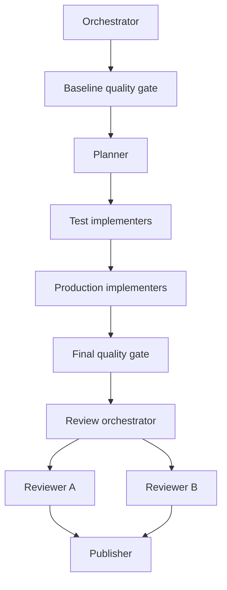

Giving one coding agent a large task and a broad instruction sounds simple. It is also a fragile way to work. The agent has to discover the repository, decide what to change, choose a test strategy, make the change, validate it, review itself, and communicate the result. Each responsibility expands the context it must hold and gives it more opportunities to make an unsupported assumption.

The alternative is an explicit squad of custom agents: specialists with bounded responsibilities, defined inputs and outputs, and a coordinator that controls the order of work.

This is the practical destination of several ideas I have written about recently:

1. [The Architecture of Code Agents: Instructions, Skills, Agents, Hooks](/posts/The-Architecture-of-Code-Agents-Instructions-Skills-Agents-Hooks/)
2. [Custom Copilot Agents](/posts/Copilot-Custom-Agents/)
3. [Prompt Caching for Coding Agents](/posts/Prompt-Caching-for-Coding-Agents/)
4. [From Hero Prompts to Shared AI Infrastructure](/posts/From-Hero-Prompts-to-Shared-AI-Infrastructure/)
5. [Knowledge Graph Tools for AI Code Agents](/posts/Code-Agent-Knowledge-Graphs/)

Context engineering supplies the right evidence to the right specialist. Graph engineering defines the controlled workflow connecting those specialists. A squad turns both into a repeatable delivery process.

I have implemented one such squad in [NetFabric.Numerics](https://github.com/NetFabric/NetFabric.Numerics/tree/main/.github/agents) to implement reliable changes. This post explains the ideas behind it, how the implementation works, and why authoring a squad by hand is substantial work.

## What Context Engineering Means Here

Context engineering is the deliberate design of what an agent sees, when it sees it, and what it must produce before the next step starts. It is more than writing a good prompt.

A useful agent context contains four kinds of information:

- **Task intent**: the complete user request and the expected behavior.
- **Local evidence**: relevant source, tests, conventions, callers, and dependencies.
- **Operating constraints**: tools, ownership boundaries, required checks, and stop conditions.
- **Handoff evidence**: the exact outputs that the next agent needs to trust or challenge the previous step.

The important part is omission. A test author does not need the publisher's Git protocol in its active context. A publisher does not need to reason through generic-math implementation details. Loading unrelated instructions makes an agent less focused, burns tokens, and makes it easier to blend unrelated facts into a plausible but wrong conclusion.

This does not eliminate hallucinations. It reduces the surface area for them. A specialist can be required to prove a claim with a focused test run, a graph query, a diff, or a deterministic gate instead of merely explaining why it believes the claim is true.

The result is a chain of evidence rather than a chain of assertions.

## Graph Engineering Is the Workflow Layer

[Graph engineering](https://www.eigent.ai/blog/graph-engineering-ai-agents) is the practice of designing a graph of agents, tasks, feedback loops, policies, and measurements. Nodes perform work or evaluate an outcome. Edges determine what may happen next, which artifact crosses a boundary, who can veto a change, and when a fast task must wait for a slower control step.

A single agent with an evaluate-and-retry prompt has one feedback loop. It can improve an answer, but it cannot independently decide whether its target was correct, whether its measurement is being gamed, or whether another loop has found a conflicting result. Graph engineering designs the topology around those limits.

For a coding squad, the work graph is concrete:

- The planner produces a plan that enables test work.
- Test evidence enables production implementation.
- The quality gate compares the final artifact against a baseline and routes regressions to the owning specialist.
- Independent reviewers can veto publication.
- The publisher runs only after the gate and review verdict meet fixed conditions.

These edges encode authority and cadence, not just execution order. The baseline snapshot is intentionally frozen after the task starts. A production implementer cannot declare its own change ready. A reviewer cannot silently edit the code it critiques. A publisher cannot relax an approval condition in order to ship. Those are anchors in the workflow: trusted inputs or constraints that the optimizing node cannot rewrite.

Repository knowledge is a separate supporting concern. In this squad, `codebase-memory-mcp` (CBM) gives planners, implementers, and reviewers a queryable code graph for structural facts such as callers, implementations, and relevant tests. As covered in [Knowledge Graph Tools for AI Code Agents](/posts/Code-Agent-Knowledge-Graphs/), that makes local discovery more reliable. It is not what graph engineering means here; the squad itself is the graph-engineered system.

## The Squad in NetFabric.Numerics

The [agent directory](https://github.com/NetFabric/NetFabric.Numerics/tree/main/.github/agents) contains nine versioned `.agent.md` files. Each file declares a role, its model, its tools, whether it is user-invocable, and its working protocol.

This implementation targets the Copilot CLI. The underlying ideas — specialized roles, evidence-carrying handoffs, explicit workflow edges, model routing, gates, and review — apply to other agent harnesses too. They are not drop-in portable, however: every harness exposes agents, subagents, tools, state, and delegation differently, so its squad configuration and protocols must be adapted to the platform.

The topology is deliberately sequential where evidence matters and parallel where work is independent:



The diagram is simplified. The real [orchestrator](https://github.com/NetFabric/NetFabric.Numerics/blob/main/.github/agents/nf-dev-orchestrator.agent.md) can route failed checks back to the test or implementation specialist, caps repair rounds, and only dispatches the publisher after approval.

## Automatic Subagents and Custom Squads

Modern agent harnesses can create subagents automatically. That is valuable for exploratory work: the harness can split a request, delegate research or implementation, and gather results without requiring the developer to pre-author every role.

An authored squad serves a different need. Its agents are named, versioned, and intentionally constrained. Their model choices, tool permissions, input contracts, output formats, joins, repair limits, and publication criteria are part of the repository. The workflow is therefore more deterministic: the same class of request follows the same guardrails, rather than relying on a parent agent to invent the delegation structure at runtime.

Automatic subagents optimize for flexibility. Custom squads optimize for control, repeatability, and governance. They are not mutually exclusive: any custom agent can use subagents internally when delegation helps its assigned role. The squad fixes the outer workflow and its guardrails; a planner, implementer, or reviewer can still use subagents for bounded research or parallel work within that role. A team can therefore use harness-created subagents for open-ended exploration and inside a squad for a high-confidence path such as production changes and pull-request delivery.

### The coordinator

`nf-dev-orchestrator` is the only agent a user invokes for a feature or bug fix. It does not edit code. Its job is to preserve the full request, dispatch the next specialist with the necessary evidence, wait at explicit joins, and enforce the protocol.

It starts by checking that the [CBM index is available and current](/posts/Code-Agent-Knowledge-Graphs/). It then captures a baseline quality snapshot before any edit. That baseline matters in an imperfect repository: a test suite can already have failures, and a later agent must distinguish an incoming failure from a new regression.

The orchestrator is a policy boundary. It prevents common shortcuts:

- No production implementation before a new test has established RED, or existing tests have been validated as relevant.
- No skipped final quality gate, even for a small change.
- No skipped review because a gate has found a problem.
- No branch, commit, push, or draft pull request before deterministic validation and review approve the artifact.

The orchestrator's model calls are naturally infrequent because it waits for other agents to complete their tasks. I configured it to use OpenAI-family models because their longer prompt-cache TTL keeps the large orchestration context warm across those staged handoffs. That is another form of control a custom squad provides: model selection can account for the workflow's timing and cache behavior, not only raw reasoning quality or per-token cost.

### The planner

`nf-dev-planner` has a narrower assignment: convert one request into a numbered table of test and implementation subtasks. It identifies exact files and symbols through the repository code graph, classifies each test task as a new or existing test, records dependencies, and marks only genuinely independent work as parallel.

The planner uses `claude-sonnet-4.6`. This is a useful example of model routing. Planning benefits from careful decomposition and explicit dependency reasoning. It does not need the same tool permissions or model choice as an agent that runs a full suite or opens a pull request.

### The test and implementation pair

The squad separates test work from production work.

`nf-dev-test-implementer` edits only xUnit and FluentAssertions test code. For a new behavior, it must run the narrowest relevant test command and report `RED established` only when the failure demonstrates the missing or incorrect requested behavior. For an existing test, it must validate that the assertions actually cover the request; it does not manufacture a failure simply to satisfy a ritual.

Only then can `nf-dev-implementer` edit production code. It receives the plan, the assigned subtask, and the test specialist's evidence. It queries the graph for affected callers, changes only the assigned production files, runs the focused acceptance command, and builds the affected project.

That separation gives each agent a clear definition of done. It also makes review and repair routing straightforward: test defects go back to the test specialist, production defects go back to the implementation specialist.

### Deterministic quality and adversarial review

`nf-dev-quality-gate` runs formatting, restore/build, and the full test suite. In baseline mode, it records stable failure signatures. In final mode, it classifies the result as `PASS`, `BASELINE ONLY`, `REGRESSION`, or `UNRESOLVED` by comparing the two snapshots. It does not edit files and it does not argue that a failure is acceptable. Its output is mechanical evidence.

It uses `gpt-5.4-mini`, a lower-cost model, because the important work is deterministic command execution and signature comparison, not open-ended code reasoning. The model needs to run the prescribed checks, preserve their output, and apply a fixed classification rule. Reserving more capable models for planning, implementation, and review improves the squad's cost profile without weakening this gate's authority.

The review stage is intentionally separate from that gate. `nf-dev-review-orchestrator` dispatches two reviewers in parallel and merges their findings. Both reviewers check correctness, API consistency, analyzer and style expectations, and test coverage, but they run with different models: Reviewer A uses `gpt-5.4` and Reviewer B uses `kimi-k3`.

Two reviewers are not a vote count. A finding from one reviewer remains valid. The value is independent inspection: different models tend to notice different failure modes, and explicit disagreements are surfaced instead of being quietly resolved by the coordinator.

### Publishing is a specialized, constrained step

`nf-dev-publisher` uses `gpt-5.4-mini` because publishing is primarily a constrained operational task, not a broad design exercise. It verifies authentication and remotes, stages only the supplied squad-owned files, creates a fresh branch, makes one commit, pushes it, and opens a draft pull request.

It refuses to publish unless the final gate is `PASS` or `BASELINE ONLY` and the review verdict is approved. It also refuses to scoop up unrelated worktree changes. This is a small role with a large practical benefit: delivery mechanics no longer dilute the context of the agent solving the engineering problem.

## A Representative Agent Definition

The files are not merely model names. They are executable operating manuals. A shortened version of the test specialist's frontmatter looks like this:

```yaml
---
description: Internal tests-first implementer for the nf-dev squad.
target: github-copilot
name: NF Dev Test Implementer
model: gpt-5.3-codex
tools: ['view', 'edit', 'create', 'search', 'bash']
user-invocable: false
---
```

The body then constrains its discovery method, edit ownership, test modes, required evidence, output format, and stop conditions. The specialized file is easy to version, review, and refine. It is also far easier to understand than one enormous prompt trying to be planner, developer, reviewer, release engineer, and repository expert at the same time.

## Why a Squad Improves Reliability

The first benefit is context isolation. Each specialist has a small job, focused tools, and a narrow set of evidence. This reduces unsupported reasoning and lowers token use.

The other benefits matter just as much:

- **Right-sized models**: use a stronger reasoning model for orchestration and planning, coding-specialized models for tests, and economical models for deterministic or operational tasks.
- **Least privilege**: a reviewer cannot edit; a test agent cannot alter production code; a publisher cannot repair implementation. Tool boundaries make accidental scope expansion harder.
- **Explicit artifacts**: plans, RED evidence, focused test results, baseline signatures, review findings, and publish results are all handoff objects. Failures have an owner and a route back.
- **Controlled parallelism**: independent work can proceed concurrently, but dependencies still require a join before the next stage begins.
- **Baseline-aware validation**: the squad can detect whether it caused a regression instead of treating every existing failure as either a blocker or something to ignore.
- **Auditability and maintenance**: every role is a small versioned file. A protocol change, model swap, or tool permission can be reviewed independently.
- **Governance**: mandatory gates and review rules are enforced by the workflow, not remembered only when an individual happens to be careful.

None of this makes an agent infallible. The point is to stop expecting infallibility. A reliable system assumes that any one step can be incomplete or wrong, then asks for independent evidence before accepting that step's result.

## The Manual Authoring Cost

This is where the idea gets demanding. A useful squad is much more than nine prompts.

For every agent, you must decide its role, model, tools, inputs, output schema, and stop conditions. For every edge between agents, you must define what evidence crosses the boundary and what happens when that evidence is missing or fails. For the whole workflow, you must decide where parallelism is safe, how many repair rounds to allow, how to distinguish baseline failures from regressions, and who owns each category of defect.

Then comes the work that is easiest to overlook: making the instructions non-contradictory, keeping the handoff formats compatible, maintaining the agents as repository conventions change, and testing the workflow against real tasks. A superficially sensible squad can still deadlock, loop indefinitely, duplicate edits, publish unrelated changes, or accept a confident but unverified answer.

The NetFabric.Numerics squad was created with the Intelligentium agent-authoring plugin.

## Agent Authoring with Intelligentium

[Intelligentium.ai](https://intelligentium.ai/) provides an agent-authoring plugin intended to make this work easier. Instead of starting with a blank agent file and manually coordinating every field and handoff, the plugin helps author structured agents and squad workflows from the same concerns described above: scoped responsibilities, model and tool selection, context, protocols, and collaboration.

That does not remove the need for engineering judgment. Someone still has to decide what evidence is sufficient before code changes, which checks are authoritative, and where a workflow should stop. But it changes the starting point. The author can focus on the design of the delivery process rather than repeatedly assembling boilerplate and remembering every configuration detail.

That is the broader lesson. Context engineering and graph engineering are not isolated techniques for getting a better answer from one prompt. Used together, they are the foundations for a development system: specialists that know what they need to know, prove what they claim, and hand work to the next role with evidence.
